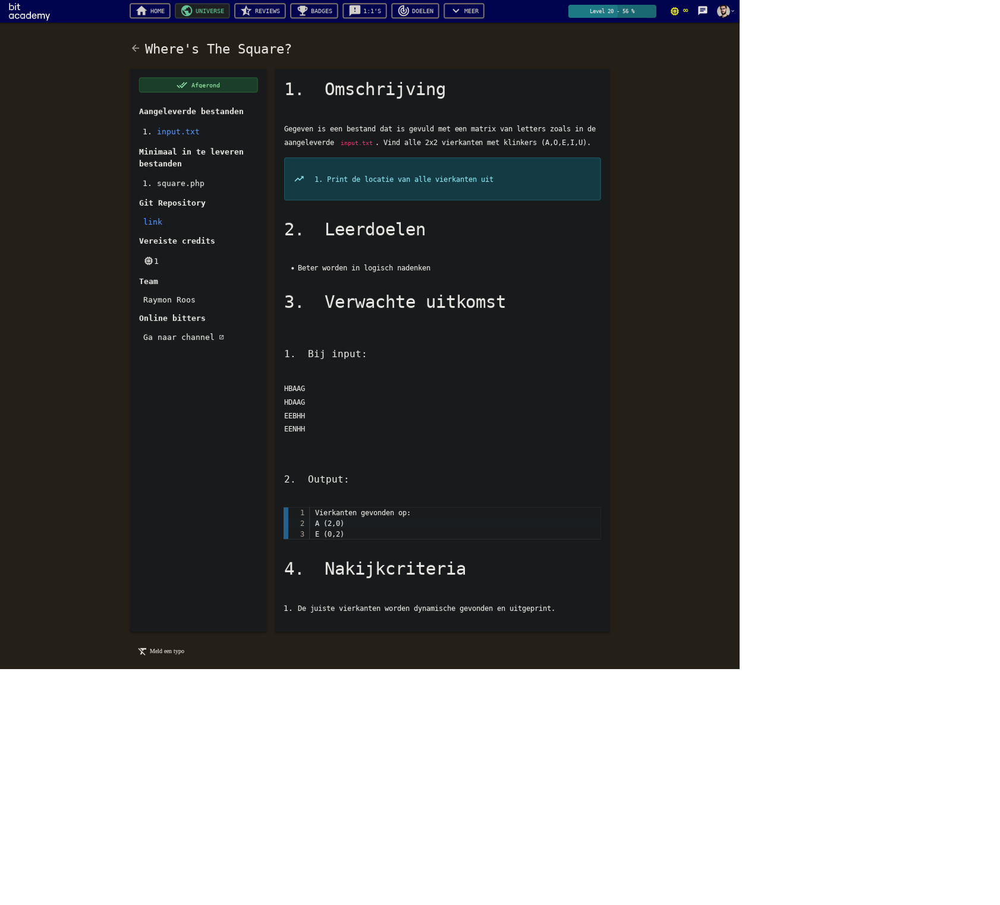
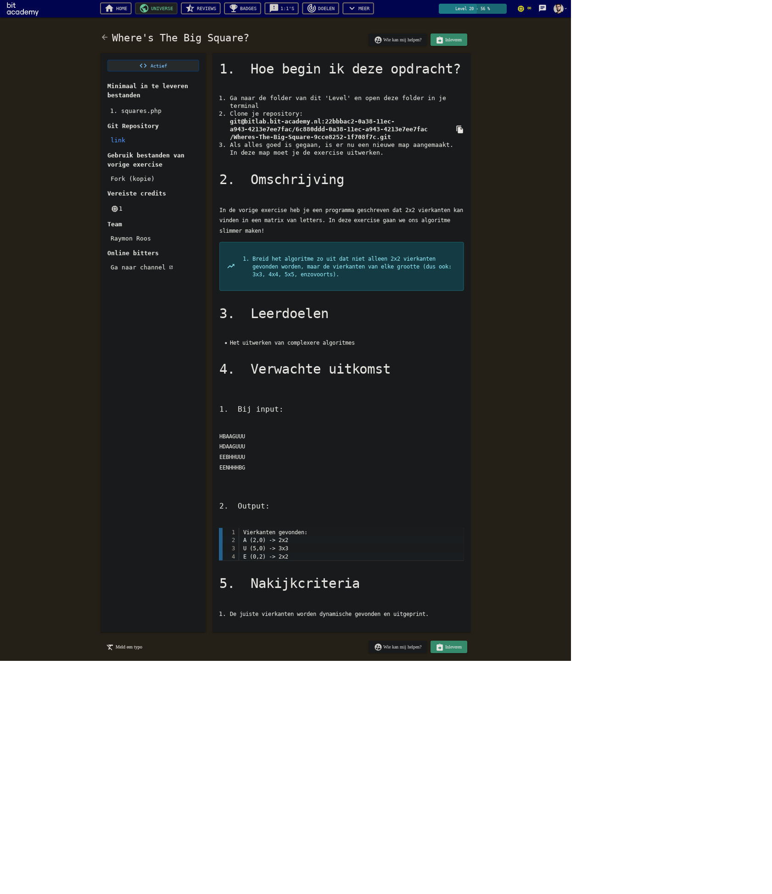

# A Much required explanation:

First of all, the input file is parsed into a two-dimensional array, representing rows and
columns of letters. This is likely as you expect. This array is stored as a global
constant, for easy access. It does not get mutated any further anyway.

To look for rectangles, `traverse()` is called, which contains nested for-each loops.
I like the extra semantics they provide, and not having to deal with off-by-one
shenanigans like you would with a regular for-loop. I do proceed to use the `$key =>
$value` syntax, so that at any point I could index into the grid, with an additional
offset.

Then, for every letter in the grid, `findRectangleSize()` is called, which is passed the
X and Y coordinates (index into the grid), and the current letter.

`findRectangleSize()` uses `checkLetter()` to determine at every step whether the letter
under examination still qualifies as potentially being part of a rectangle of repeated
vowels. I.e. the letter is a vowel, and identical to the other reference letter.

`findRectangleSize()` is responsible for “Looking ahead”, to calculate the number of
surrounding identical vowels. For this it uses nested while-loops (computational
complexity is through the roof!). _while_ The current letter is a vowel, and the next
letter in the same row is identical, increase the row offset (`$width`). When arriving at
the end of a set of repeated vowels in a row, proceed to the next row, jumping back to the
same point in the row as where it started in the previous row.

So for looking ahead in every next row, the X-offset had to be reset back to zero. This is
why there are so many integers being tracked. I had to separate measuring rectangle
dimensions from traversal and lookahead. (`$maxwidth` is also the culprit of the critical
limitation of this script!).

I admit it's a little hard to follow how the information gathered by `findRectangleSize()`
is used. Basically, I used an array to make it have multiple return values, and then
immediately destructure that array. The first value (`size`) is stored in another
two-dimensional array (`$sizeMap`) that mirrors the geometry of the input grid. This size
is the counter for the amount of repeated vowels encountered in the current rectangle. The
other values, `$width` and `$height` are only used when printing the final result, if the
current square is indeed a valid match.

Basically, `$sizeMap` is a sort of map, where for every position in the map, it stores the
number of surrounding identical vowels. So the top left corner of a 3×3 rectangle holds
the value 9. It only counts in straight lines, so the next position holds the value 6,
because it is the top left position of a 3×2 rectangle that is contained in the larger
rectangle. You can uncomment the line `printGrid($sizeMap)` to see what it looks like.

This information is tracked in order to only print out the largest surrounding rectangles.
For this `isOutermostRectangle()` is used, which contains a neat bit of boolean algebra.
`$biggerThenPrevious` at every point is only ever true or false. Additional comparisons
are only added (note the `&&`), if a previous position in the `$sizeMap` exists to compare
against. I really wish there was a prettier way to guard against out-of-bound array
offsets, but the null-coalescing operator (`??`) doesn't work for nested array offsets…

`$sizeMap` is filled with sizes _by looking ahead_, so the top-left point of a rectangle
will always have the largest size value. We can identify the outermost rectangle then, by
checking if no larger size value exist in an immediately previous position.

In summary, the script is essentially reading right to left, for as long as the same vowel
is repeated consecutively in the same row. After which it proceeds to the next row to do
the same, in order to count to number of repeated identical vowels that surround each
letter in the grid. If the current letter is the origin point of the largest possible
rectangle, its letter and dimensions are printed to the console.

# Problems

Performance: This solution would require a lot of memory for large inputs, not to mention
the quadruple nested loops. Though it only finishes the inner two loops only in case there
is an actual rectangle at that location. 
An improvement would be if it could skip ahead in the grid using the bounds of a detected
square, so it wouldn't be repeating so much work. 

It does not actually detect rectangles! Only squares! The problem is in how “rectangles”
are tested for validity, using the `$maxwidth` value. I wanted to avoid false positives
for patterns like this : 
```
A A A A A
A X X X X
A X X X X
A X X X X
A X X X X
```
where the inner surface of the rectangle isn't actually populated with vowels. For this
I chose traverse the entire content of the rectangle, going line by line. In order to go
left-to-right in every row, I had to reset the X-offset. But I also had to know the width
of rectangle. I used `$maxWidth` for that, which is pretty arbitrary.

This means the following pattern: 
```
A X X X X
A A A X X
A A X X X
A A A A X
A A A X X
A A X X X
```

Would have a size of 15 at the top-left position. But obviously there is no rectangle with
that size there, so I added a check to see whether the size matches the geometry. I.e.
whether `$width * $height === $size`. However, because `$width` is actually `$maxWidth`,
it holds the value 4 in this case, because that was the largest width in this area. But
though there isn't a rectangle with that width, there **is** a 5×2 rectangle that isn't
being picked up on now. For that, the logic for detecting the largest possible valid
rectangle in a given area will have to be a lot more sophisticated, and I have no Idea how
to approach that…

# Questions

Do you reckon there is additional overhead associated with building the two-dimensional
grid of letters?
In PHP, you can index into strings just like you can with arrays, so it isn't actually
necessary to transform the input file (though you cannot use for-each on strings). You
could use the index of the newline character to dynamically determine the length of a row,
and use that as an offset to access the next row.

Could it be that building an entire map of sizes is redundant? It only needs to compare
against the previous values after all. If it did only store the previous size, would that
be an example of memoization? 

I'm a little displeased with how often I'm passing around the same three parameters to
multiple different functions. I get the impression my use of multiple functions might have
been too heavy-handed, considering all these functions apparently desire the same state
and context.

What do you think of this solution? Is it a reasonable approach, or did I altogether miss
the point? 

## The challenge:

See the following screenshots:

### Level 1



### Level 2



### Further suggestions

Supply a large grid of arbitrary dimensions (maybe generated through a script) and
optimize your solution to be as fast as possible.
